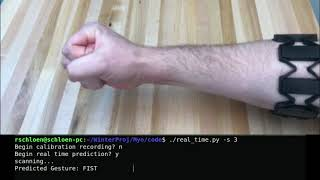
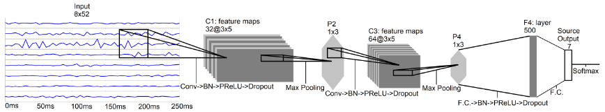
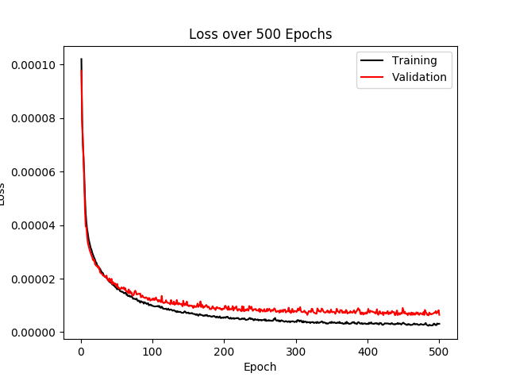
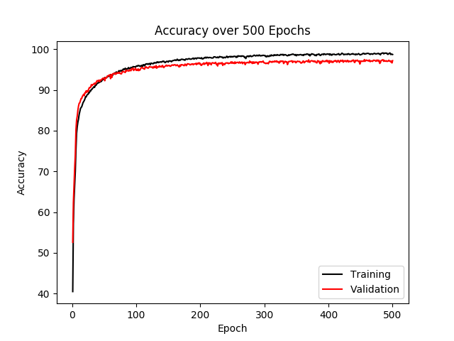
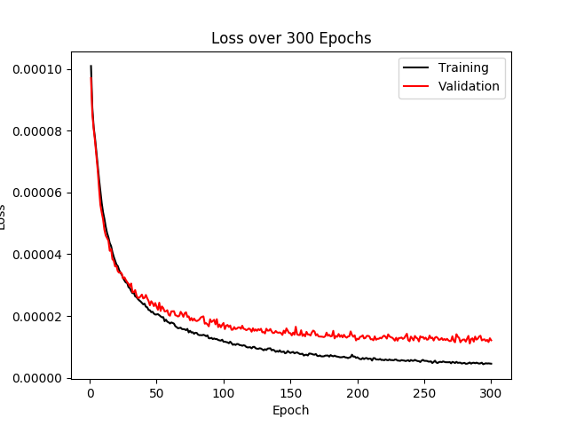

# Surface Electromyograph (SEMG) Control for a robotic hand
## Robert Schloen

The goal of this project was to achieve accurate, real time prediction of hand gestures using surface electromyography (SEMG) and deep learning with transfer learning. Transfer learning is the concept of using the relationships learned from one problem on a similar problem. In this case, I am using transfer learning to take the relationships learned from one data set of EMG recordings and applying it to a new smaller data set to reduce the training time and effort. Using this method, a model more specific to an individual can be quickly trained from a relatively small amount of data.

 To acquire the SEMG signals, I used Thalmic Lab's Myo Armband, along with code adapted from the [PyoConnect](http://www.fernandocosentino.net/pyoconnect/) library, which provides eight channels of raw EMG signal at 200 Hz. I also used data from database 5 of the Ninapro SEMG databases[1], which also used the Myo Armband, as the data for pre-training the neural network. From the Ninapro database, I selected 7 gestures: flexion of all 5 fingers, open hand, and closed hand (fist) (Exercise A(1), 1,3,5,7,12 and Exercise B(2),5 and 6 found in [2]).

### Instructions:
#### Setup:
For this project I used a linux computer, pytorch, and a Myo Armband. To see how to setup the Myo Armband on linux, check out this page for [PyoConnect](http://www.fernandocosentino.net/pyoconnect/). To begin real time prediction you will need the bluetooth dongle for the Myo Armband connected to your computer.

#### Quick start:
In the terminal run `./real_time.py [-s 0] [-g 3]`
This will prompt you to perform the calibration. The -s and -g flags can be used to set the calibration channels, if known, instead of performing the calibration. If you do not know the values, don't include them and run the calibration instead.
To run the calibration enter 'y' for yes or 'n' for no.
If you do run the calibration, simply perform the gestures several times, being sure to do each gesture at least once, then use `ctrl-c` to stop the calibration.
After calibration is completed you will be prompted to begin real time prediction. Like for calibration, enter 'y' for yes and 'n' for no.
When you hit yes, you can begin performing the gestures and the predicted gesture will be displayed.

#### Advanced:
If you find that the model is not predicting your gestures well, you can record your own data and retrain the model to be better tuned to you.

###### Data Acquisition   
The first thing you need is your own data. The armband should be placed just below your elbow on your forearm. To record your own data, first you will need to go into the `myo_raw.py` script and find the line that opens the csv files (line 444) and rename the files. The file should start with 'raw_EMG_' and 'gesture_' and end with a number starting from 1 to however many recordings you make to make manipulating the data easier later. (Ex. `recording_1.csv`)

Then you can run the script in the terminal: `./myo_raw.py`

A new window will show up with the plot of the EMG data. It is important that this window stays selected throughout the recording process, or else the labels would be recorded correctly. Once the recording begins, perform the gestures in 5 second intervals, with 5 seconds with your hand open (at rest) between each gesture. While you are performing the gesture, press the corresponding number on your keyboard: Index finger = 1, middle finger = 2, ring finger = 3, pinky finger = 4, thumb = 5, and fist = 6. The open hand gesture is automatically labeled when you are not pressing any button. You should record for between 3 to 5 minutes, and for best results, record several of these files making small changes to the position of the armband.

Once you have your data, open up the `transfer_learn.py` script and edit the path variable to match the name of your file between the 'raw_EMG_' and number, and you may also want to change the `new_path` variable to fit your personal naming convention. If you change `new_path`, make sure `new_PATH` is changed to the same thing.

Then in the terminal run: `./transfer_learn.py -g True`

The `-g` flag tells the script to generate a file that combines all your files into a `.npy` file containing the samples and their labels, automatically split into training, validation, and testing datasets. You will also see the most active channel for each file printed in the terminal. If you didn't move the armband since making the recording, you can use that number with `-s` flag when you run the `real_time.py` script again, and you won't have to do the calibration.

###### Training the model
With your combined data set, run: `./transfer_learn.py`

This will begin training your model with your new data. If you have access to a computer with a GPU, this is the step where you would want to use it to speed up the training. The name of the saved model (line 125) can be changed as well, just be sure to change the `model_path` in real_time.py as to match.

Once your model is trained, you can run `./real_time.py [-s 0] [-g 3]` the same way as before.

#### Additional files:
`myo_feat_extract.py`: Can be used to plot the recorded EMGs. Simply edit the file name to match the EMG and gesture dataset you would like to visualize.

`data_loader.py`: This file contains the Dataset class used in training the networks. The Dataset class can be used with Dataloaders to easily iterate through your dataset. This script also has the code that generated the pre-training dataset. Optional flags: `-g`: (True or true or t)/False) Generate dataset from raw data or calculate sampling stats of dataset. `-s`:(True or true or t)/False) Set to true to sample existing dataset or false to generate dataset

`sEMG_network.py`: This file contains the custom architecture for the convolutional neural networks that are used for training. For more information about what each layer does see the [Pytorch API](https://pytorch.org/docs/stable/nn.html).

`train_net.py`: This file contains the Trainer class, which implements the training loop. Running this file will train the pre-trained network using the tuned hyperparameters. This file also contains a function for hyperparameter tuning.

`common.py`: Support file needed for `myo_raw.py`, part of the [PyoConnect](http://www.fernandocosentino.net/pyoconnect/) files.

`pnn_train.py`: (In progress) This file will allow for training progressive neural networks, a form of transfer learning.

### Convolutional Neural Networks (CNN) and Transfer Learning
Convolutional neural networks are a type of deep learning that are commonly used to classify images. The convolutional layers pass a kernel, or filter, over the image and extract a feature map representing an abstract or lower level feature within the image. After passing through multiple convolutional layers, these features are then connected to fully connected, or dense, layers and the relationships between the now connected features are learned and used to classify the image. The image, in the case of this project, is the SEMG data that has been sampled in 260 ms windows with a 235 ms overlap. The 260 ms window was chosen to deal with input latency [3] since this is for real time prediction. Since the sample rate of the Myo armband is 200Hz, 260ms corresponds to 52 samples, and the armband has 8 channels. Therefore, the 'image' passed through the CNN is an array of 52 x 8 x 1, height x length x depth (channels: RBG color images have 3 channels for example).

The CNN used for this project was initially adapted from a paper on deep learning for SEMG hand gesture recognition [3]. I adapted the architectures for raw EMG signals described in the paper into the architectures `Network` and `Network_enhanced` found in `sEMG_network.py`. The basic `Network` consisted of a convolutional layer, RELU activation function, and max pooling function that was connected to a fully connected layer. The CNN ends with a softmax function that outputs an array the length of the number of outputs (7 classes) with values corresponding to the likelihood that the input is in each of the classes. The predicted class is then the index with the highest valued element. This basic was not used for training the models and served more as a tutorial for learning pytorch. The `Network_enhanced` CNN was an expansion of `Network` by the authors of the paper. This network had additional convolutional and fully connected layers, PRELU, as well as batch normalization which serves as a form of regularization by maintaining a standard distribution of activation values during training [3]. Batch normalization is helpful in reducing overfitting. Dropout was also used in the enhanced model, which randomly zeros elements in the input tensor as another form of regularization to reduce overfitting. This network was used when training the models for several of the early weeks of the project and achieved a maximum accuracy of approximately 91%.

Building off of the enhanced network, I further expanded the CNN and tested various combinations of number of all layers, kernel size, padding and stride in an effort to improve the accuracy and reduce overfitting. While it was not feasible to test every possible combination, I was able to improve the accuracy of the CNN a little. The final network was achieved by reducing the number of feature maps in the first layer, adding another convolutional layer, and adding padding. I continued to use PRELU for the activation function, batch normalization, and dropout layers as well. This final network was used for the last few weeks of the project, and achieved a maximum accuracy of approximately 95%.

* Figure 1: Diagram of enhanced CNN architecture from [3] which I adapted to create the final CNN

Once the CNN was trained on the data from the Ninapro database, transfer learning, specifically fine-tuning was used to retrain the model with the data recorded from my own arm. The process for recording the data from myself is described in the Data Acquisition section of the instructions above. Once I had the data, I loaded in the pre-trained model and retrained the model. The process of fine-tuning with regards to transfer learning is to reinitialize the last fully connected layers, which hold some of the relationships between the features generated from the convolutional layers. This way, the lower level features are preserved, if modified somewhat, even with the new data, and the classification in the final layers are more specific to the new data. Figure 2 below shows the results of retraining the model with my own data.

* Figure 2: Plots of loss and accuracy of the finetuned network over 500 epochs.

#### Results

While these results are pretty good, the problem with fine-tuning is that its prone to losing a lot of the original relationships from the pre-trained model, a concept called catastrophic forgetting. Another problem is the variability present in the placement of electrodes between different subjects and between different sessions of recording. I have found the classification accuracy is much better when the data is recorded and the model trained while the armband has not been moved. In an effort to reduce the loss of accuracy between sessions, I implemented a calibration for the recorded data. The calibration consists of calculating the most active channel, of the 8 channels from the integrated EMG of the rectified EMG signal. Once the most active channel is identified, all the recordings are then circle shifted so that the most active channels are lined up with the first recording. This calibration seems to improve the accuracy between sessions for a subject, the overall accuracy is still much lower than from the same session. In the future, I would like to continue working on another approach in transfer learning, progressive neural networks (PNN). PNNs freeze the weights of the pre-trained network so the pre-trained network won't loss its learned relationships, and then add the pre-trained weights to the new model so that it can learn from the pre-trained model.

#### Training and testing
The Trainer class in `train_net.py` is used to train and test the model, as well as record and plot statistics. The training loop consists of looping through a number of epochs that can be set by the user, and for each epoch does the following: pull sample(s) from training Dataloader per the set data loader parameters, pass inputs through model, calculate loss by comparing prediction to label for that input using loss function, update weights by back-propagating the loss, and take a step for the optimizer. The loss function and optimizer are set during initialization of the Trainer class. After each epoch, the epochs running loss and accuracy are calculated and printed and written to a file. Then the validation phase is performed by running another epoch, but using the validation Dataloader, and setting the model to evaluation mode, which prevents the same updates to weights that would happen during training. The same stats are recorded for the validation epoch. Once the training loop has gone through the set number of epochs, a final test epoch is run using the test DataLoader and the the same stats are again recorded. The trained model, and plots of the loss and accuracy over the epochs can be saved, if desired, such as when training with the tuned hyperparameters.

The dataloaders are created using a pytorch Dataset class object, as mentioned in the instructions. The Dataset class, found in `data_loader.py` loads in the dataset from a .npy file, and depending on the mode input passed when initialized, separates the desired set, either training, validation, or testing, from the rest of the data. The corresponding Dataloader will then only pull samples and labels from one of these sets. When the data is windowed (also in `data_loader.py`) the data is also normalized and randomly separated into one of the three sets in an approximate ratio of 80% training, 10% validation, and 10% testing.

* Figure 3: Plots of loss and accuracy of the pre-trained network over 300 epochs.

#### Hyperparameter tuning

Tuning the hyperparameters of a neural network is always important for getting the best performance. To tune the hyperparameters for my CNN, I used `for` loops to iterate through the options or potential values and created a model for that value, then trained and tested each model and recorded its performance. Then for each hyperparameter that was tuned, I selected the values from the model that performed the best. The `hyperparam_selection` function in `train_net.py` provides an example of what the loop would look like.

The following is a list of the tuned hyperparameters and their value: For the optimizer: AdamW was selected with learning rate: 0.0008858667904100832, and weight_decay: 0.04832930238571752. For loss function: CrossEntropyLoss was chosen with mean reduction (the default in the end). For data loader parameters: batch size: 1000. Several hyperparameters from the CNN model were also tuned as discussed earlier.

##### Future Work

As mentioned previously, I plan to continue working on a PNN as a method for improving the accuracy between sessions and subjects. Additionally, I only used 7 gestures for this project, so adding additional gestures from the Ninapro dataset is a natural next step, and the additional classes should not affect the overall accuracy too much. Finally, the ultimate goal of this project is to be able to control a robotic hand, so another natural next step is to implement this model, with its predictions, on a physical robot.

### References:
    [1] Stefano Pizzolato, Luca Tagliapietra, Matteo Cognolato, Monica Reggiani, Henning Müller, Manfredo Atzori, Comparison of six electromyography acquisition setups on hand movement classification tasks, PLOS One, 2017
    [2] Manfredo Atzori, Arjan Gijsberts, Claudio Castellini, Barbara Caputo, Anne-Gabrielle Mittaz Hager, Simone Elsig, Giorgio Giatsidis, Franco Bassetto & Henning Müller. Electromyography data for non-invasive naturally-controlled robotic hand prostheses. Scientific Data, 2014" (http://www.nature.com/articles/sdata201453).
    [3] Cote-Allard, Ulysse, et al. “Deep Learning for Electromyographic Hand Gesture Signal Classification Using Transfer Learning.” IEEE Transactions on Neural Systems and Rehabilitation Engineering, vol. 27, no. 4, June 2019, pp. 760–771., doi:10.1109/tnsre.2019.2896269.
    [4] M.  Zia  ur  Rehmanet  al.,  “Multiday  emg-based  classification  of  handmotions with deep learning techniques,”Sensors, vol. 18, no. 8, p. 2497,2018.
